# Secure Azure Functions (Flex Consumption) with VNet Integration

This project provisions a secure, enterprise-grade Azure Serverless infrastructure using **Azure Functions Flex Consumption Plan**. It is designed to be a "Zero Trust" environment where public access is restricted, and internal services communicate over **Private Endpoints**. The infrastructure is defined using **Bicep** and deployed via **Azure Developer CLI (`azd`)**.

## 🏗️ Architecture Overview

```mermaid
graph TD
    subgraph Azure["Azure Cloud"]
        style Azure fill:#f9f9f9,stroke:#999
        
        subgraph VNet["Virtual Network"]
            style VNet fill:#e1f5fe,stroke:#0277bd,stroke-width:2px
            
            subgraph AppSubnet["App Subnet (Microsoft.Web/serverFarms)"]
                style AppSubnet fill:#ffffff,stroke:#0277bd,stroke-dasharray: 5 5
                FuncApp["⚡ Azure Function<br/>(Flex Consumption)"]:::function
            end
            
            subgraph PESubnet["Private Endpoint Subnet"]
                style PESubnet fill:#ffffff,stroke:#0277bd,stroke-dasharray: 5 5
                PE_Blob["🔒 PE: Blob Storage"]:::pe
                PE_Queue["🔒 PE: Queue Storage"]:::pe
                PE_Table["🔒 PE: Table Storage"]:::pe
                PE_KV["🔒 PE: Key Vault"]:::pe
            end
        end

        subgraph ManagedServices["Paas Resources"]
            style ManagedServices fill:#f3e5f5,stroke:#7b1fa2
            
            Storage["📦 Storage Account<br/>(Public Access Disabled)"]:::storage
            KV["🔑 Key Vault<br/>(Public Access Disabled)"]:::kv
            SB["🚌 Service Bus (Basic)<br/>(RBAC Auth Only)"]:::sb
        end
        
        Monitor["📊 App Insights &<br/>Log Analytics"]:::monitor
    end

    %% Networking Flows
    FuncApp <-->|"VNet Integration"| PE_Blob
    FuncApp <-->|"VNet Integration"| PE_Queue
    FuncApp <-->|"VNet Integration"| PE_Table
    FuncApp <-->|"VNet Integration"| PE_KV
    
    %% Private Link Connections
    PE_Blob -.->|"Private Link"| Storage
    PE_Queue -.->|"Private Link"| Storage
    PE_Table -.->|"Private Link"| Storage
    PE_KV -.->|"Private Link"| KV
    
    %% Service Bus Flow (Public but RBAC secured)
    FuncApp -- "HTTPS (RBAC)" --> SB
    
    %% Monitoring
    FuncApp -.-> Monitor

    %% Styling
    classDef function fill:#cdbcff,stroke:#5e35b1,color:black;
    classDef storage fill:#a5d6a7,stroke:#2e7d32,color:black;
    classDef kv fill:#fff59d,stroke:#fbc02d,color:black;
    classDef sb fill:#ffcc80,stroke:#ef6c00,color:black;
    classDef pe fill:#eeeeee,stroke:#616161,stroke-width:1px,color:black;
    classDef monitor fill:#b3e5fc,stroke:#0277bd,color:black;
```



The solution deploys the following Azure resources:

- **Azure Function App (Flex Consumption Plan):** Hosted in a Virtual Network subnet delegated to `Microsoft.Web/serverFarms`.
- **Virtual Network (VNet):** Contains specific subnets for the Function App and Private Endpoints.
- **Azure Storage Account:** Secured with Private Endpoints for Blob, Queue, and Table services. Public access is disabled.
- **Azure Key Vault:** Secured with a Private Endpoint. Used for secret management.
- **Azure Service Bus (Optional):** Deployed on the Basic tier (can be upgraded) with RBAC authentication enforced.
- **Managed Identities:** User-Assigned Managed Identity is used for all service-to-service authentication (Zero Keys approach).
- **Monitoring:** Application Insights and Log Analytics Workspace for observability.

### Security Highlights

- **No Access Keys:** All connections (Function to Storage, Function to Service Bus, Function to Key Vault) use Microsoft Entra ID (Managed Identity) authentication.
- **Private Networking:** Critical resources (Storage, Key Vault) are not accessible via the public internet.
- **RBAC Enforcement:** Local authentication (SAS keys) is disabled where possible (e.g., Service Bus `disableLocalAuth: true`).

## 🚀 Getting Started

### Prerequisites

- Azure CLI
- Azure Developer CLI (`azd`)
- PowerShell (for the setup script)
- Git

### Installation

1. **Clone the repository:**

    ```bash
    git clone https://github.com/your-username/azure-functions-flex-dotnet-vnet.git
    cd azure-functions-flex-dotnet-vnet
    ```

2. **Initialize the Environment Variables:**

    This project uses a PowerShell script to generate consistent, compliant resource names and set environment variables for azd.

    **Secure Production Setup (Default):**

    Run the script to configure a secure environment with VNet integration enabled:

    ```powershell
    .\setEnv.ps1 -Environment dev -AppName myapp -Location eastus -createKV $true -createServiceBus $true -vnetEnabled $true -Apply
    ```

    **Public Development Setup:**

    For rapid development or testing where public access is acceptable (and costs/complexity of VNet are not needed), you can disable VNet integration. Resources will be publicly accessible.

    ```powershell
    .\setEnv.ps1 -Environment dev -AppName myapp -Location eastus -createKV $true -createServiceBus $true -vnetEnabled $false -Apply
    ```

    **Parameters:**

    - `-Environment`: Environment name (e.g., `dev`, `stg`, `prd`).
    - `-AppName`: Short name for your application (e.g., `scanner`, `vdo`).
    - `-Location`: Azure region (e.g., `eastus`, `westeurope`).
    - `-createKV`: `$true` to provision a Key Vault.
    - `-createServiceBus`: `$true` to provision a Service Bus Namespace.
    - `-vnetEnabled`: `$true` (default) creates VNet and Private Endpoints. `$false` skips VNet creation and enables public access on resources.
    - `-Apply`: specific switch to apply the configuration to `azd`. Without this, it only performs a dry run.

3. **Provision Infrastructure:**

    Since code deployment is handled separately (or disabled in azure.yaml), use azd provision to create the Azure resources.

    ```bash
    azd provision
    ```

## ⚙️ Configuration Details

### Naming Conventions

The `setEnv.ps1` script handles complex naming rules, especially for resources with strict limits like Key Vault (24 chars) and Storage Accounts (24 chars, no special characters).

- **Key Vault:** `kv-<short-app>-<short-env>-<short-loc>-<short-bu>-<random>`
- **Storage:** `st<alphanumeric><random>`

### Environment Variables

The Bicep templates automatically configure the Function App with the following settings:

- `AZURE_CLIENT_ID`: The Client ID of the User Assigned Managed Identity.
- `AzureWebJobsStorage__credential`: `managedidentity` (Uses RBAC for storage).
- `ServiceBusConnection__fullyQualifiedNamespace`: The DNS name of your Service Bus.
- `ServiceBusConnection__credential`: `managedidentity`.

## 📦 Deployment

This repository focuses on **Infrastructure as Code (IaC)**. The application code deployment logic has been decoupled from `azd` to allow for flexibility in CI/CD pipelines. To deploy your function code, you can use the Azure Functions Core Tools or GitHub Actions:

```bash
func azure functionapp publish <your-function-app-name> --dotnet-isolated